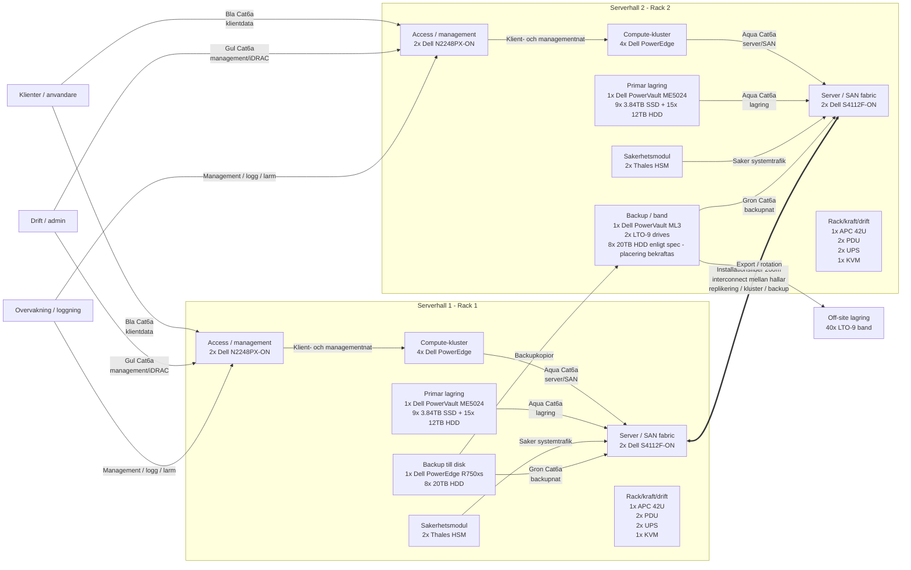

# DuckTech - Data Migrering

v. 0.1.3 Datum: 04/05/2026 Författare: Mikael

 
Dokuments ändringar 

|**Version**|**Datum**|**Ändring**|**Författare**|
|:---|:---|:---|:---|
|0.1.3| 04/05/2026|Har lagt till Teknisk Systemspecifikation|Mikael|
|0.1.2| 04/05/2026|Uppdaterat dokumentation, börjat med riskanalys|Mikael|
|0.1.1| 30/04/2026|La till dokument version|Mikael|
|0.1.0| 30/04/2026|Dokument skapat|Mikael|

## Innehållsförteckning
**1.** Bakgrund till migrering 
**2.** Säker dokumentation och ITIL 
**3.** Roller och ansvarsområden 
**4.** Projektmodell: Hybrid (Vattenfall + Scrum) 
**5.** Anpassning och utbildning 
**6.** Riskanalys 
**7.** Teknisk Systemspecifikation 

## Om DuckTech
DuckTech förser företag med modern och säker Cyber- och IT-infrastruktur. Försvarsmakten har länge varit DuckTech´s största kund men har under de senaste årens poltiska 
utveckling ökat sina krav på säkerhet och suviränitet. För att fortsatt få leverera till försvarsmakten måste DuckTech anpassa sin verksamhet efter dessa krav.

Anställda ca: 100

### 1. Bakgrund till migrering.
DuckTech´s nuvarande molntjänst hos Google Workspace ses inte längre som ett säkert alternativ. Försvarsmakten
har höjt sina krav på säkerhet och suviränitet, för att uppfuylla detta har DuckTech valt att skapa sin egen molntjänst och migrera sin data från Google Workspace till
privat server, försvarmakten baserar sin analys pga av det politiska läget i USA och omvärlden.

Huvudsyftet men migrationen är att skapa en säker och isolerad miljö för vidareutveckling av Cyber- och IT-infrastruktur för militärt bruk. 
Under detta projekt kommer omfattande riskanalys genomföras av lokaler, personal, hård och mjukvara för att säkerställa kraven från FMV.

### 2. Säker dokumentation och ITIL
Djupgående dokumentation kommer ske löpande under projektets gång och efter att projektet är avklarat, uppdatering av dokumentationen när verksamheten utvecklas 
kommer också vara av stor vikt. Förvaring av dokument ska säkerställas så obehöriga ej får tillgång till dokumentationen, krav: SUA (Säkerhetsskyddad upphandling).
Server konfigurering kommer dokumenteras av samtliga servrar och backup kommer göras. Nya rutiner för dokumentation kommer krävas av de anställda då det är mycket viktigt
om ändringar sker.

ITIL kommer tillämpas för att DuckTech på ett effektivt och skalbart sätt ska kunna utveckla sin verksamhet efter behov. 
Stor fokus kommer läggas på Change Management eftersom stora förändringar inom företaget kommer ske med eget ansvar för tex. backups, underhåll av serverhallar och övrig 
IT-infrastruktur. 

### 3. Roller och ansvarsområden
|Roll|Namn|Ansvar |
|:---|:---|:---|
|**Kravansvarig**| Ahmed| Regelbunden kontakt med FMV för att säkerställa att krav uppfylls och meddela projektledningen om ändringar sker. |
|**Presentation**| Jonas| Tillhandahåller information om förändringar i DuckTechs verksamhet till de anställda och utbildar personalen gällande nya rutiner och verktyg. |
|**Teknikansvarig**| Patrik|Ansvarar för att lokaler och hårdvara uppfyller säkerhetskraven. Överser byggnationen av serverhallar. |
|**Dokumentation**| Mikael|Utför dokumentation av arbetet. |
|**Testare**| Abdinasir |Testning av system och hårdvara. |

### 4. Projektmodell: Hybrid (Vattenfall + Scrum)
Då projektet har en längre tidsram, >1år, kommer planeringen använda en hybridmodell, vattenfallsmodellen och Scrum. Projektet kommer delas upp i mindre projekt månadsvis, 
med undantag av säkerhetsprövning av personalen. Vattenfallsmodellen fungerar bra för att få en överblick av projektet i sin helhet, mindre projekt kommer 
följa den övergripande planeringen. Det är viktigt att varje delmoment följer “vattenfallets” helhet då överliggande projekt är kritiska för att underliggande projekt 
ska kunna starta.  

Scrum kommer tillämpas för varje delmoment för att eventuella förändringar ska kunna hanteras snabbt och flexibelt för att leva upp till den övergripande tidsplanen. 

### 5. Anpassning och utbildning
Säkerhetsprövning kommer ske löpande under projektets 4 första månader. Om någon av de anställda brister i säkerhetskonrtollen får DuckTech starta
rekrytering av ny ansställd för att täcka den tappade rollen. Nya säkerhetskrav kommer ställas på de anställda och utbildning kommer ske under projektets gång för att 
säkerställa att kraven på personal uppfylls.
Även utbildning inom de nya systemen kommer ske löpande när projektet börjar närma sig slutfasen.
Eventuell rekrytering kommer ske för att täcka underhåll av serverhallar och för hantering av incidenter, tex driftstop av server eller dataintrång.
ITIL kommer vara centralt för förändringarna och fortsatt verkasmhet. Change, problem och incident management kommer ha stort fokus när
företager går från publikmolntjänst till lokal. 
#### 5.1 Change
Det kommer vara en stor omställning för DuckTech, för att få en bra övergång till det nya arbettsättet kommer personalen löpande utbildas 
och nya rutiner kommer implementeras. Behörigheter måste bestämmas, vem som har behörighet till vad.
#### 5.2 Problem
Vid en stor omställning är det nästan omöjligt att undvika problem, det är viktigt att uppdaga problem i ett tidigt skede eller omstäntigheter som kan leda
till framtida problem. Här kommer noggrann dokumentation vara viktigt för att kunna se var problemet har sitt ursprng och vad man kan göra för att undvika det
i framtiden.
#### 5.3 Incident
Sätta upp en tydlig plan vid driftstop eller dataintrång. Vem ansvarar för drift av servrar? Vem hanterar eventuella dataintrång.
Hur hanteras gammal hårdvara?

### 6. Riskanalys
Djupgående analys om lokaler, personal, hård och mjukvara. Lokaler för serverhallar och arbetsutrymmen kommer anpassas efter FMV´s krav på säkerhet.
Handlingsplan för eventuella dataintrång och driftstop av servrar. Stort fokus kommer läggas på redundans och high availability. 

### Risk: Planering och byggnation
|Risk|Beskrivning|Sannolikhet|Konsekvens|Risknivå|Åtgärd|
|:---|:---|:---|:---|:---|:---|
|**Säkerhetsprövning**|Nyckelpersonal nekas säkerhetsklassning.|2|4|8|Ha konsulter reda för att täcka behovet tills ny medarbetare kan anställas.|
|**Hårdvara**|Brist på hårdvara pga värdsläget och stora inköp till AI-datacenter.|4|4|16|Planera inköp i ett tidigt skede.|
|**Spräckt budget**|Nya krav från FMV.|2|3|6|Change management och tydlig kommunikation med DuchTech om krav ändras.|
|**Serverhallar**|Förseningar och dolda fel.|3|3|9|Noggrann inventering av lokaler och tidsbuffert.|

### Risk: Nätverk och grundinstallation
|Risk|Beskrivning|Sannolikhet|Konsekvens|Risknivå|Åtgärd|
|:---|:---|:---|:---|:---|:---|
|**Kablage**|Bristande kvalite|1|4|4|Noggrann upphandling och kvalitets kontroll.|
|**Personalbrist**|Frånvaro pga sjukdom, ledighet eller liknande.|2|3|6|Planering och säkerhetsklassad extrapersonal som kan rycka in vid behov.|
|**Spräckt budget**|Nya krav från FMV.|2|4|8|Change management och tydlig kommunikation med DuchTech om krav ändras.|

### Risk: Migration och övergång till nya system
|Risk|Beskrivning|Sannolikhet|Konsekvens|Risknivå|Åtgärd|
|:---|:---|:---|:---|:---|:---|
|**Dataläcka**|Data exponeras mot internet under migration.|2|5|10|Använd VPN vid export.|
|**Big Bang-haveri**|De nya servrarna orkar inte med lasten vid driftsättning.|1|5|5|Genomför migrering stegvis och ha roll back planerat.|
|**Korrupt data**|Data korrumperas under export.|2|5|10|Använd haschar för att kontrollera data förre och efter flytt.|
|**Nytt system**|Personal kan inte nya systemet.|1|5|5|Introdusera nya system stegvis och utbilda personal.|

### Risk: Drift och administration
|Risk|Beskrivning|Sannolikhet|Konsekvens|Risknivå|Åtgärd|
|:---|:---|:---|:---|:---|:---|
|**Avlyssning**|Elektromagnetiskt läckage gör att data kan läsas utifrån.|3|5|15|Implementera tempest nät och zonindelning.|
|**Infiltratör**|En anställd med behörighet stjäl krypteringsnycklar.|1|5|5|Tvåmansstyre vid kritiska ändringar och strikt loggning.|
|**Utbyte av hårdvara**|Data ligger kvar hos Googles eller på gammla diskar.|2|5|10|Kontrollera att data sanitization har utförts och förstör utbytt hårdvara.|
|**Drift stop**|Server går sönder eller drift stör av strömavbrott.|2|5|10|Säkerställ redundans och HA. UPS för kortare avbrott och diselaggregat för längre avbrott.|
|**Inbrott**|Obehörig person tar sig in i DuckTechs lokaler.|1|5|5|Larm och passersystem med loggning, kamera övervakning.|
|**Brand**|Brand utbryter i serverhall/övrig lokal.|2|5|10|Installation av Siemens – Sinorix 1230.|
|**Temperatur**|Överhetning av servrar.|3|5|15|CRAC(Computer Room Air Conditioner) i kombination med sensorer för att känna av temperatur avvikelser.|

### 7. Teknisk Systemspecifikation

|Vara|Antal|Modell|Beskrivning|
|:---|:---|:---|:---|
|**Servernoder**|8|Dell PowerEdge|4 per serverhall|
|**Hardware Security Modules**|4|Thales|2 per serverhall|
|**Lagringschassi**|2|Dell PowerVault ME5024|1 per serverhall|
|**SSD**|18|3.84TB SSD SAS Mixed Use|För system/cache, 9 per serverhall|
|**HDD**|30|12TB HDD SAS 7.2K|Lagring, 15 per serverhall|
|**Backupschassi**|1|Dell PowerEdge R750xs|Backup för serverhall 1|
|**Backup Disk**|16|20TB HDD SAS 7.2K|Backup disk, 8 per serverhall|
|**Switch**|4|Dell Networking S4112F-ON|2 per serverhall|
|**Switch**|4|Dell N2248PX-ON|2 per serverhall|
|**Backupschassi**|1|Dell PowerVault ML3|Backup för serverhall 2 med Tape Library med 2x LTO-9 drives|
|**Off-site lagring**|40|LTO-9 Band (Media)|För off-site lagring/lång tids lagring|
|**Rackskåp**|2|APC NetShelter SX 42U|1 per serverhall|
|**PDU**|4|APC Metered Rack PDU|2 per serverhall|
|**UPS**|4|APC Smart-UPS SRT 3000VA|2 per serverhall|
|**KVM-konsol**|2|Dell FPM185|1 per servehall|
|**Cat6a-kablar (Blå)**|100|CommScope|1.5m, Klientdata/Användare|
|**Cat6a-kablar (Gul)**|40|CommScope|1.5m, Management (iDRAC)|
|**Cat6a-kablar (Grön)**|40|CommScope|2m, Backup-nätverk|
|**Cat6a-kablar (Aqua)**|60|CommScope|3m, SAN & Server-kopplingar|
|**Installationsfiber**|1 rulle|CommScope|200m, Förbindelse mellan hall 1 och 2|

