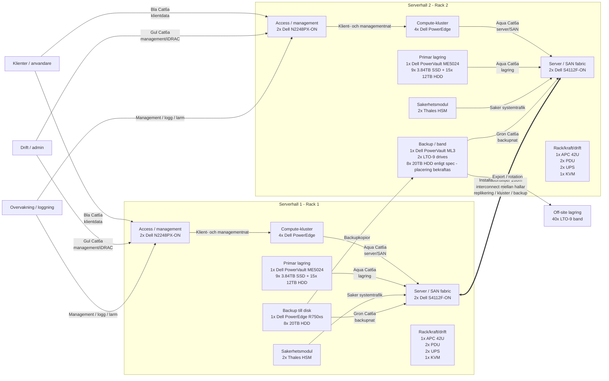
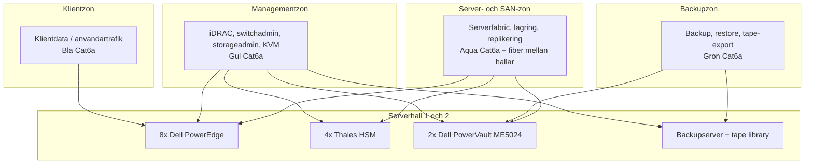
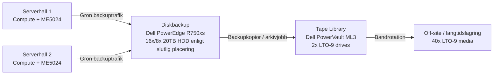

# DuckTech - Data Migrering

v. 1.1.3 Datum: 04/05/2026 Författare: Mikael

 
Dokuments ändringar 

|**Version**|**Datum**|**Ändring**|**Författare**|
|:---|:---|:---|:---|
|1.1.3| 04/05/2026|Lagt till Jonas dokumentation|Mikael|
|0.1.3| 04/05/2026|Har lagt till Teknisk Systemspecifikation|Mikael|
|0.1.2| 04/05/2026|Uppdaterat dokumentation, börjat med riskanalys|Mikael|
|0.1.1| 30/04/2026|La till dokument version|Mikael|
|0.1.0| 30/04/2026|Dokument skapat|Mikael|

## Innehållsförteckning
**1.** Bakgrund till migrering 
**2.** Syfte och mål 
**3.** Föreslagen lösning 
**4.** Säker dokumentation 
**5.** Roller och ansvarsområden 
**6.** Genomförande enligt vattenfallsmodellen 
**7.** Anpassning och utbildning 
**8.** Riskanalys 
**9.** Migreringsplan 
**10.** Teknisk Systemspecifikation 
**11.** Övergripande miljökarta 
**12.** Backup och återställning 
**13.** Test och acceptans 
**14.** Drift och support enligt ITIL 
**15.** Dokumentation och överlämning 
**16.** Slutsats 

## Om DuckTech
DuckTech förser företag med modern och säker Cyber- och IT-infrastruktur. Försvarsmakten har länge varit DuckTech´s största kund men har under de senaste årens poltiska 
utveckling ökat sina krav på säkerhet och suviränitet. För att fortsatt få leverera till försvarsmakten måste DuckTech anpassa sin verksamhet efter dessa krav.

Anställda ca: 100

### 1. Bakgrund till migrering.
DuckTech´s nuvarande molntjänst hos Google Workspace ses inte längre som ett säkert alternativ. Försvarsmakten
har höjt sina krav på säkerhet och suviränitet, för att uppfuylla detta har DuckTech valt att skapa sin egen molntjänst och migrera sin data från Google Workspace till
privat server, försvarmakten baserar sin analys pga av det politiska läget i USA och omvärlden.

Huvudsyftet men migrationen är att skapa en säker och isolerad miljö för vidareutveckling av Cyber- och IT-infrastruktur för militärt bruk. 
Under detta projekt kommer omfattande riskanalys genomföras av lokaler, personal, hård och mjukvara för att säkerställa kraven från FMV.

### 2. Syfte och mål 

Syftet med projektet är att ta fram en plan för hur DuckTech kan migrera sina viktigaste tjänster från Google-baserade molntjänster till en lokal servermiljö på ett säkert och kontrollerat sätt. 
Lösningen ska ge företaget bättre kontroll över dokument, projektfiler, användarkonton, behörigheter, backup och återställning. 

Målet är att DuckTechs dokument och projektfiler ska lagras på en lokal filserver i stället för i externa molntjänster. 
Användarkonton och behörigheter ska administreras internt, och känslig information ska skyddas genom lokal lagring, begränsade behörigheter, säker nätverksåtkomst och regelbunden backup. 

Projektet omfattar filserver, behörighetshantering, backup, VPN för säker fjärråtkomst, grundläggande nätverksskydd samt rutiner för drift och support. 
Projektet omfattar inte utveckling av DuckTechs simulatorprogram, utan fokuserar på IT-infrastruktur och informationshantering. 

### 3. Föreslagen lösning 

DuckTech ska införa en lokal servermiljö där filer, användarkonton, behörigheter och backup hanteras internt. Miljön ska skyddas med brandvägg, behörighetsstyrning, VPN och stark autentisering för säker fjärråtkomst. 
Det ger företaget bättre kontroll över sin information och minskar beroendet av externa molntjänster. 

Den nya miljön ska bestå av en lokal filserver för dokument och projektfiler, en central katalogtjänst för användarkonton och grupper, exempelvis Active Directory, samt en backupserver eller annan backuplösning för säkerhetskopiering. B
ehörigheter ska styras enligt principen minsta möjliga åtkomst, vilket innebär att användare bara får tillgång till den information de behöver för sitt arbete. 

För att lösningen ska vara säker och driftsäker ska backup köras regelbundet och återställning testas. Systemet ska även logga viktiga händelser, till exempel inloggningar, behörighetsändringar och administratörsåtgärder. 
Servermiljön ska kunna uppdateras och underhållas utan att verksamheten påverkas mer än nödvändigt. 

### 4. Säker dokumentation
Djupgående dokumentation kommer ske löpande under projektets gång och efter att projektet är avklarat, uppdatering av dokumentationen när verksamheten utvecklas 
kommer också vara av stor vikt. Förvaring av dokument ska säkerställas så obehöriga ej får tillgång till dokumentationen, krav: SUA (Säkerhetsskyddad upphandling).
Server konfigurering kommer dokumenteras av samtliga servrar och backup kommer göras. Nya rutiner för dokumentation kommer krävas av de anställda då det är mycket viktigt
om ändringar sker.
 
### 5. Roller och ansvarsområden
|Roll|Namn|Ansvar |
|:---|:---|:---|
|**Kravansvarig**| Ahmed| Regelbunden kontakt med FMV för att säkerställa att krav uppfylls och meddela projektledningen om ändringar sker. |
|**Presentation**| Jonas| Tillhandahåller information om förändringar i DuckTechs verksamhet till de anställda och utbildar personalen gällande nya rutiner och verktyg. |
|**Teknikansvarig**| Patrik|Ansvarar för att lokaler och hårdvara uppfyller säkerhetskraven. Överser byggnationen av serverhallar. |
|**Dokumentation**| Mikael|Utför dokumentation av arbetet. |
|**Testare**| Abdinasir |Testning av system och hårdvara. |

### 6. Genomförande enligt vattenfallsmodellen 

Vattenfallsmodellen passar projektet eftersom arbetet kan delas upp i tydliga faser där varje fas skapar underlag för nästa. Det gör projektet enklare att planera, följa upp och kvalitetssäkra. 

## 6.1 Förstudie och kravinsamling 
I den första fasen kartläggs nuvarande Google-tjänster, filstruktur, användare, behörigheter, datamängd och säkerhetskrav. Här identifieras vilka data och tjänster som behöver migreras samt vilka delar av miljön som är mest verksamhetskritiska. 
Resultatet blir en nulägesanalys och en kravspecifikation. 

#### 6.2 Design 
I designfasen planeras hur den nya servermiljön ska byggas upp. Här tas en teknisk design fram för filserver, katalogtjänst, behörighetsgrupper, VPN, backup, loggning och nätverkssäkerhet. Designen ska kunna användas som grund för implementationen. 

#### 6.3 Implementering 
Under implementeringen installeras och konfigureras servrar och nödvändiga tjänster. Det omfattar bland annat katalogtjänst, filresurser, grupper, behörigheter, VPN och backup. Därefter kan en testmigrering genomföras med ett begränsat urval av filer. 

#### 6.4 Testning 
Före driftsättning testas inloggning, filåtkomst, behörigheter, VPN, backup, återställning och loggning. Testerna ska göras med både vanliga användarkonton och administratörskonton för att säkerställa att systemet fungerar korrekt och att rätt åtkomst gäller. 

#### 6.5 Driftsättning 
När testerna är godkända flyttas data stegvis från Google Drive till den lokala filservern. Användarna informeras om ny filstruktur, inloggning och supportväg. En stegvis övergång minskar risken för driftstörningar och gör det enklare att åtgärda problem. 

#### 6.6 Avslut, överlämning och förvaltning 
När migreringen är verifierad kan den gamla molnlösningen begränsas. Lösningen dokumenteras och driftinstruktioner lämnas över till IT-ansvariga. 
Efter införandet krävs löpande underhåll, övervakning, behörighetshantering och förbättringar för att miljön ska fortsätta vara säker och stabil. 

### 7. Anpassning och utbildning
Säkerhetsprövning kommer ske löpande under projektets 4 första månader. Om någon av de anställda brister i säkerhetskonrtollen får DuckTech starta
rekrytering av ny ansställd för att täcka den tappade rollen. Nya säkerhetskrav kommer ställas på de anställda och utbildning kommer ske under projektets gång för att 
säkerställa att kraven på personal uppfylls.
Även utbildning inom de nya systemen kommer ske löpande när projektet börjar närma sig slutfasen.
Eventuell rekrytering kommer ske för att täcka underhåll av serverhallar och för hantering av incidenter, tex driftstop av server eller dataintrång.
ITIL kommer vara centralt för förändringarna och fortsatt verkasmhet. Change, problem och incident management kommer ha stort fokus när
företager går från publikmolntjänst till lokal. 
#### 7.1 Change
Det kommer vara en stor omställning för DuckTech, för att få en bra övergång till det nya arbettsättet kommer personalen löpande utbildas 
och nya rutiner kommer implementeras. Behörigheter måste bestämmas, vem som har behörighet till vad.
#### 7.2 Problem
Vid en stor omställning är det nästan omöjligt att undvika problem, det är viktigt att uppdaga problem i ett tidigt skede eller omstäntigheter som kan leda
till framtida problem. Här kommer noggrann dokumentation vara viktigt för att kunna se var problemet har sitt ursprng och vad man kan göra för att undvika det
i framtiden.
#### 7.3 Incident
Sätta upp en tydlig plan vid driftstop eller dataintrång. Vem ansvarar för drift av servrar? Vem hanterar eventuella dataintrång.
Hur hanteras gammal hårdvara?

### 8. Riskanalys
Djupgående analys om lokaler, personal, hård och mjukvara. Lokaler för serverhallar och arbetsutrymmen kommer anpassas efter FMV´s krav på säkerhet.
Handlingsplan för eventuella dataintrång och driftstop av servrar. Stort fokus kommer läggas på redundans och high availability. 

### Risk: Planering och byggnation
|Risk|Beskrivning|Sannolikhet|Konsekvens|Risknivå|Åtgärd|
|:---|:---|:---|:---|:---|:---|
|**Säkerhetsprövning**|Nyckelpersonal nekas säkerhetsklassning.|2|4|8|Ha konsulter reda för att täcka behovet tills ny medarbetare kan anställas.|
|**Hårdvara**|Brist på hårdvara pga värdsläget och stora inköp till AI-datacenter.|4|4|16|Planera inköp i ett tidigt skede.|
|**Spräckt budget**|Nya krav från FMV.|2|3|6|Change management och tydlig kommunikation med DuchTech om krav ändras.|
|**Serverhallar**|Förseningar och dolda fel.|3|3|9|Noggrann inventering av lokaler och tidsbuffert.|

### Risk: Nätverk och grundinstallation
|Risk|Beskrivning|Sannolikhet|Konsekvens|Risknivå|Åtgärd|
|:---|:---|:---|:---|:---|:---|
|**Kablage**|Bristande kvalite|1|4|4|Noggrann upphandling och kvalitets kontroll.|
|**Personalbrist**|Frånvaro pga sjukdom, ledighet eller liknande.|2|3|6|Planering och säkerhetsklassad extrapersonal som kan rycka in vid behov.|
|**Spräckt budget**|Nya krav från FMV.|2|4|8|Change management och tydlig kommunikation med DuchTech om krav ändras.|

### Risk: Migration och övergång till nya system
|Risk|Beskrivning|Sannolikhet|Konsekvens|Risknivå|Åtgärd|
|:---|:---|:---|:---|:---|:---|
|**Dataläcka**|Data exponeras mot internet under migration.|2|5|10|Använd VPN vid export.|
|**Big Bang-haveri**|De nya servrarna orkar inte med lasten vid driftsättning.|1|5|5|Genomför migrering stegvis och ha roll back planerat.|
|**Korrupt data**|Data korrumperas under export.|2|5|10|Använd haschar för att kontrollera data förre och efter flytt.|
|**Nytt system**|Personal kan inte nya systemet.|1|5|5|Introdusera nya system stegvis och utbilda personal.|

### Risk: Drift och administration
|Risk|Beskrivning|Sannolikhet|Konsekvens|Risknivå|Åtgärd|
|:---|:---|:---|:---|:---|:---|
|**Avlyssning**|Elektromagnetiskt läckage gör att data kan läsas utifrån.|3|5|15|Implementera tempest nät och zonindelning.|
|**Infiltratör**|En anställd med behörighet stjäl krypteringsnycklar.|1|5|5|Tvåmansstyre vid kritiska ändringar och strikt loggning.|
|**Utbyte av hårdvara**|Data ligger kvar hos Googles eller på gammla diskar.|2|5|10|Kontrollera att data sanitization har utförts och förstör utbytt hårdvara.|
|**Drift stop**|Server går sönder eller drift stör av strömavbrott.|2|5|10|Säkerställ redundans och HA. UPS för kortare avbrott och diselaggregat för längre avbrott.|
|**Inbrott**|Obehörig person tar sig in i DuckTechs lokaler.|1|5|5|Larm och passersystem med loggning, kamera övervakning.|
|**Brand**|Brand utbryter i serverhall/övrig lokal.|2|5|10|Installation av Siemens – Sinorix 1230.|
|**Temperatur**|Överhetning av servrar.|3|5|15|CRAC(Computer Room Air Conditioner) i kombination med sensorer för att känna av temperatur avvikelser.|

### 9. Migreringsplan 

Migreringen ska genomföras kontrollerat och stegvis för att minska risken för dataförlust, felaktiga behörigheter och driftstörningar. Först exporteras och inventeras material från Google Drive. 
Filer och mappar sorteras efter projekt, avdelning och känslighetsnivå. Gammalt, duplicerat eller irrelevant material kan arkiveras separat innan migreringen genomförs. 

Därefter skapas en motsvarande filstruktur på den lokala filservern. Behörigheter ska kopplas till grupper i katalogtjänsten i stället för till enskilda användare, eftersom det ger enklare administration och bättre kontroll över åtkomst. 
Innan full migrering genomförs bör DuckTech göra en pilotmigrering med en mindre grupp användare för att testa filstruktur, åtkomst, prestanda och arbetssätt. 

Efter migreringen ska filantal, mappstruktur, behörigheter och åtkomst kontrolleras. Användarna ska bekräfta att de kommer åt rätt filer och att de inte kommer åt information de saknar behörighet till. 
Först när migreringen är verifierad bör Google-lösningen stängas för aktiv användning eller begränsas till arkivläge. 

### 10. Teknisk Systemspecifikation

|Vara|Antal|Modell|Beskrivning|
|:---|:---|:---|:---|
|**Servernoder**|8|Dell PowerEdge|4 per serverhall|
|**Hardware Security Modules**|4|Thales|2 per serverhall|
|**Lagringschassi**|2|Dell PowerVault ME5024|1 per serverhall|
|**SSD**|18|3.84TB SSD SAS Mixed Use|För system/cache, 9 per serverhall|
|**HDD**|30|12TB HDD SAS 7.2K|Lagring, 15 per serverhall|
|**Backupschassi**|1|Dell PowerEdge R750xs|Backup för serverhall 1|
|**Backup Disk**|16|20TB HDD SAS 7.2K|Backup disk, 8 per serverhall|
|**Switch**|4|Dell Networking S4112F-ON|2 per serverhall|
|**Switch**|6|Dell N2248PX-ON|3 per serverhall|
|**Backupschassi**|1|Dell PowerVault ML3|Backup för serverhall 2 med Tape Library med 2x LTO-9 drives|
|**Off-site lagring**|40|LTO-9 Band (Media)|För off-site lagring/lång tids lagring|
|**Rackskåp**|2|APC NetShelter SX 42U|1 per serverhall|
|**PDU**|4|APC Metered Rack PDU|2 per serverhall|
|**UPS**|4|APC Smart-UPS SRT 3000VA|2 per serverhall|
|**KVM-konsol**|2|Dell FPM185|1 per servehall|
|**Cat6a-kablar (Blå)**|100|CommScope|1.5m, Klientdata/Användare|
|**Cat6a-kablar (Gul)**|40|CommScope|1.5m, Management (iDRAC)|
|**Cat6a-kablar (Grön)**|40|CommScope|2m, Backup-nätverk|
|**Cat6a-kablar (Aqua)**|60|CommScope|3m, SAN & Server-kopplingar|
|**Patchpaneler (24-port)**|10|CommScope|Ordning och reda|
|**Vägguttag (Dubbla)**|100|CommScope|Kontors tillbehör|
|**Installationsfiber**|1 rulle|CommScope|200m, Förbindelse mellan hall 1 och 2|
|**Cat6a Installationskabel**|15 rullar|CommScope|Kablar för att ansluta kontor till server|
|**Övervakning**|15|Axis Q3536-LVE|Övervakningskamera med vandalskydd IK10+|
|**Brandsläckning**|2|Siemens – Sinorix 1230|Kemisksläckning för bränder i elektronisk utrustning|
|**Kylning**|2|Vertiv - Liebert PCW|Kylning med indirekt frikyla från utomhusluft|
|**Säkerhetsdörrar**|8|ASSA ABLOY|Marknadsledande dörr med motorlås|

### 11. Övergripande miljökarta

Logisk natverkskarta

Backup- och off-site-karta

### 12. Backup och återställning 

Backup ska genomföras dagligen för viktiga filer, projektdata och systemkonfigurationer. Minst en backupkopia bör vara skyddad mot radering, kryptering eller annan påverkan från den ordinarie servermiljön, till exempel genom offlinebackup eller annan isolerad lagring. 
Det minskar risken för permanent dataförlust vid tekniska fel, misstag eller säkerhetsincidenter. 

DuckTech behöver även en tydlig återställningsrutin. Rutinen ska beskriva vem som ansvarar för återställning, vilka system och filer som prioriteras, hur snabbt data ska kunna återställas och hur återställningen ska verifieras. 
Det bör också finnas dokumenterade steg för hur IT-personal ska agera vid dataförlust eller driftstörning. 

Återställningstest ska genomföras regelbundet för att säkerställa att backupkopiorna fungerar. En backup är inte tillräcklig om den inte går att återställa inom rimlig tid. Därför ska resultat från återställningstester dokumenteras och följas upp som en del av den löpande driften. 

### 13. Test och acceptans 

Innan driftsättning ska lösningen testas både tekniskt och funktionellt. De tekniska testerna ska kontrollera serverstatus, nätverksanslutning, brandvägg, VPN, backup, återställning och loggning. 
Syftet är att säkerställa att infrastrukturen fungerar stabilt och att viktiga säkerhets- och driftfunktioner är aktiva. 

De funktionella testerna ska kontrollera att användare kan logga in, öppna rätt mappar och arbeta med filer på den lokala filservern. Testerna ska även säkerställa att användare inte kommer åt mappar eller information som de saknar behörighet till. 
Därför bör tester genomföras med konton från olika roller och avdelningar, till exempel utveckling, administration, projektledning och IT-administration. 

Acceptanskriterierna bör vara att rätt användare når rätt information, att obehörig åtkomst blockeras, att VPN fungerar för fjärranvändare, att backup och återställning fungerar samt att loggning och driftinstruktioner finns dokumenterade. 
När dessa kriterier är uppfyllda kan lösningen godkännas för driftsättning. 

### 14. Drift och support enligt ITIL 

Efter driftsättning ska ITIL användas som stöd för förvaltning av servermiljön. ITIL hjälper DuckTech att arbeta strukturerat med support, incidenter, problem, förändringar och förbättringar. 
Målet är att miljön ska kunna drivas säkert och stabilt över tid. 

**Service desk** 
Användare ska ha en tydlig kontaktväg för supportärenden. Ärenden kan till exempel handla om inloggning, åtkomst till mappar, VPN-problem eller återställning av filer. 
Service desk fungerar som första kontaktpunkt och ser till att ärenden registreras, prioriteras och skickas vidare vid behov. 

**Incidenthantering** 
Incidenter ska hanteras snabbt för att återställa normal drift och minska påverkan på verksamheten. Exempel på incidenter är att filservern inte svarar, att en användare inte kommer åt en mapp eller att VPN ligger nere. 

**Problemhantering** 
Om samma typ av fel återkommer ska grundorsaken analyseras. Om flera användare ofta får VPN-problem kan orsaken till exempel vara felaktig konfiguration, kapacitetsproblem eller klientprogramvara. 
Problemhantering minskar risken för att samma incident uppstår igen. 

**Change management** 
Förändringar i servermiljön ska planeras, riskbedömas och godkännas innan de genomförs. Exempel på förändringar är systemuppdateringar, ändrade behörigheter, ny backupstrategi eller förändringar i nätverket. 
Det minskar risken för att ändringar skapar nya driftproblem. 

**Configuration management** 
DuckTech bör dokumentera servrar, system, nätverk, konton, grupper och viktiga beroenden. Dokumentationen gör felsökning, support, säkerhetsgranskning och framtida ändringar enklare. 

**Continual improvement** 
Efter införandet bör DuckTech regelbundet följa upp incidenter, backupresultat, användarnas behov och säkerhetsrutiner. På så sätt kan lösningen förbättras över tid och anpassas efter nya krav från verksamheten. 

### 15. Dokumentation och överlämning 

När projektet avslutas ska DuckTech ha teknisk dokumentation över den nya servermiljön. Dokumentationen ska beskriva serverstruktur, filstruktur, behörighetsgrupper, katalogtjänst, backup, VPN, nätverkssäkerhet, loggning och supportflöden. 
Den ska också innehålla instruktioner för vanliga driftuppgifter, till exempel att skapa användare, ändra behörigheter, hantera grupper och återställa filer från backup. 

Överlämningen ska ske från projektet till driftansvariga. IT-ansvariga ska få tillgång till dokumentation, driftinstruktioner, kontaktvägar och information om eventuella kvarstående åtgärder. 
På så sätt kan den nya miljön förvaltas på ett kontrollerat sätt efter driftsättning. 

Detta passar både vattenfallsmodellen och ITIL. Vattenfallsmodellen avslutas med dokumentation och överlämning av en färdig lösning, medan ITIL-processerna tar vid i den löpande driften. 

 

### 16. Slutsats 

DuckTech bör gå från Google-baserade molntjänster till en lokal servermiljö för att få bättre kontroll över känslig information, behörigheter, backup och drift. 
Den föreslagna lösningen ger företaget en tydligare teknisk struktur, stärker informationssäkerheten och minskar beroendet av externa molntjänster. 

Vattenfallsmodellen ger projektet en tydlig arbetsordning från förstudie och kravanalys till design, implementering, test, driftsättning och överlämning. Det gör migreringen enklare att planera, följa upp och kvalitetssäkra. 

ITIL ger struktur för den fortsatta driften genom service desk, incidenthantering, problemhantering, change management, konfigurationshantering och kontinuerlig förbättring. 
illsammans ger vattenfallsmodellen och ITIL DuckTech både en plan för införandet och rutiner för att förvalta lösningen säkert och stabilt efteråt.

